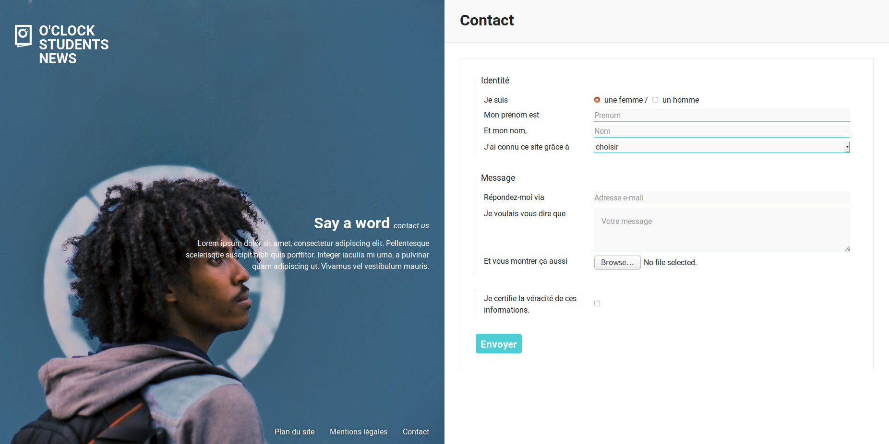

# oNews Contact

Ça y est, la home est prête :tada:

Ajoutons donc une nouvelle page à oNews... et pourquoi pas une petite page de contact ?!

## Info

Pour "J'ai connu ce site grâce à ?", voici les réponses possibles :

- Facebook
- Twitter
- Google
- Bouche à oreilles
- JT de 13h de Jean-Pierre Pernault
- Autre

## Charte

### Visuels

Le dossier `images` contient un nouveau visuel `gabriel.png`

### Couleurs

- bordure du formulaire : #eaeaea
- bordure de champ / bouton : #4cced3
- fond de champ : #f9f9f9

Enfin... on vous dit ça mais... le CSS est déjà fait :wink: Par contre, notre intégrateur n'y connait rien aux formulaires, on vous laisse vous en occuper :hugs: Ah et il a pas trouvé comment afficher Gabriel ici et Nicole sur la page d'accueil sans tout réécrire, mais il doit y avoir un moyen !

## Whaaat ?!

Pas de panique ! Pour découvrir les balises à utiliser, allons voir le **MDN** :
<https://developer.mozilla.org/fr/docs/Web/Guide/HTML/Formulaires/Mon_premier_formulaire_HTML>

Plus précisément, on va utiliser ces balises-là :

- <https://developer.mozilla.org/fr/docs/Web/HTML/Element/form>
- <https://developer.mozilla.org/fr/docs/Web/HTML/Element/fieldset>
- <https://developer.mozilla.org/fr/docs/Web/HTML/Element/legend>
- <https://developer.mozilla.org/fr/docs/Web/HTML/Element/label>
- <https://developer.mozilla.org/fr/docs/Web/HTML/Element/input>
- <https://developer.mozilla.org/fr/docs/Web/HTML/Element/textarea>
- <https://developer.mozilla.org/fr/docs/Web/HTML/Element/button>
